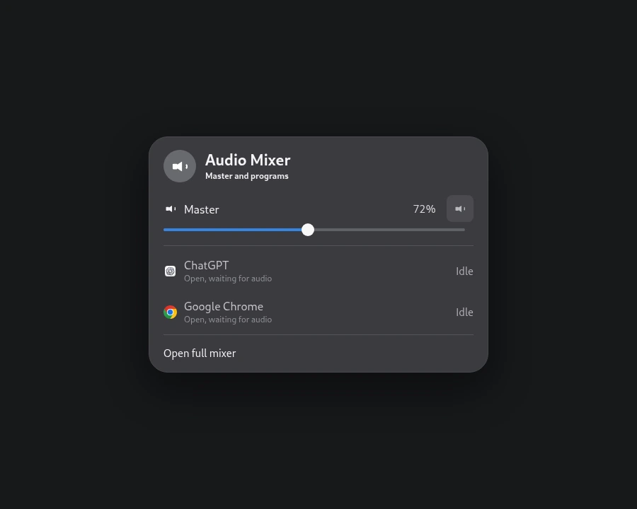
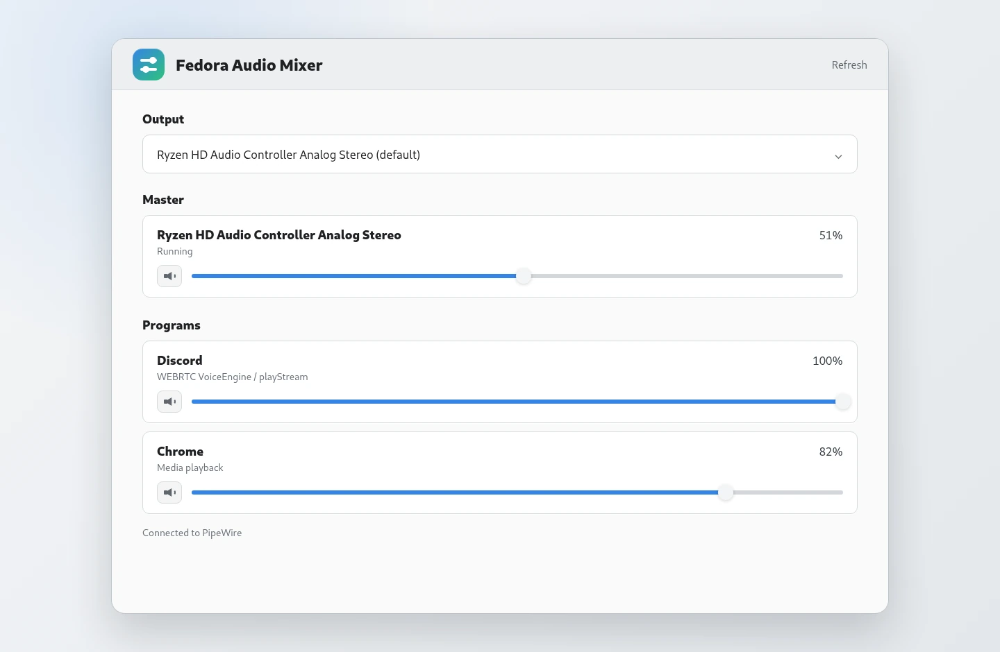

# Fedora Audio Mixer

Fedora Audio Mixer is a small Linux audio mixer for Fedora GNOME desktops. It gives you a full desktop mixer window and a GNOME Quick Settings tile from one installer.

It is built for Fedora systems using PipeWire through PulseAudio compatibility.

## Features

- Master output volume and mute
- Open program list, including apps that are open but silent
- Saved volume and mute controls for open, silent programs
- Automatic preset application when an app starts audio
- Draggable volume sliders in Quick Settings
- Clickable percentages for typing an exact volume
- GNOME Quick Settings **Mixer** tile
- Full GTK mixer app for a larger view
- One install script for both interfaces
- One uninstall script to remove everything it installs

Linux only exposes a live per-program audio stream after an app starts making sound. While an app is silent, Fedora Audio Mixer saves the volume and mute setting you choose, then applies it automatically when that app creates its next audio stream.

## Screenshots

### Quick Settings



### Full Mixer



## Requirements

- Fedora GNOME
- GNOME Shell 50
- PipeWire with PulseAudio compatibility
- `pactl`
- Python 3 with GTK 4 and PyGObject
- `gnome-extensions`

These are present on the Fedora system this project was built on.

## Install

```bash
./install.sh
```

The installer adds:

- A **Fedora Audio Mixer** launcher to the app grid and dock search
- A `fedora-audio-mixer` command in `~/.local/bin`
- A `fedora-audio-mixer@local` GNOME Shell extension
- A **Mixer** tile in GNOME Quick Settings

On Wayland, log out and back in once if the Quick Settings tile does not appear immediately.

## Use

Open **Fedora Audio Mixer** from the app grid, or open GNOME Quick Settings and use the **Mixer** tile.

In Quick Settings, drag a slider to adjust volume continuously. For an exact value, click its percentage, type a number, and press **Enter** or click elsewhere to apply it.

Open programs keep these controls even while silent. Changes made in Quick Settings or the full mixer are shared and used the next time that program starts audio.

You can also run the app directly from this folder:

```bash
./run-app.sh
```

## Package

Create a single zip download:

```bash
./make-download.sh
```

The output is `fedora-audio-mixer.zip` next to this folder.

Regenerate the README screenshots:

```bash
python3 tools/render_screenshots.py
```

## Uninstall

```bash
./uninstall.sh
```

This removes the app launcher, command, icon, installed app files, and GNOME Shell extension.

## Project Layout

```text
app/          GTK desktop mixer
extension/    GNOME Shell Quick Settings tile
install.sh    Installs both interfaces
uninstall.sh  Removes both interfaces
run-app.sh    Runs the desktop app from source
```

## Notes

The desktop app and shell extension are bundled together as one project, but GNOME installs them through different mechanisms. The installer handles both so users only need one download.

No license has been selected yet.
